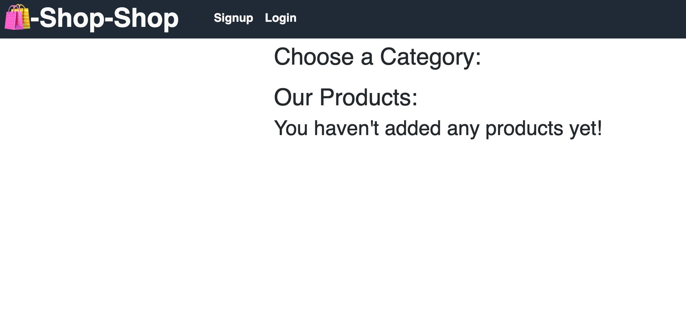

<h1 align="center">Redux Store</h1>

---

<h4 style="font-weight: bold;" align="center">Boot Camp HW # 18: Redux Store</h4>

## Table of Contents

- [About](#about)
- [Usage](#usage)
- [Built With](#built_using)
- [Questions](#questions)
- [Screenshots](#screenshots)

## 

This is a simple book search engine application that uses the Google Books API. Users can also create an account so that they can store books to reference later.

## 

1. Navigate to the Heroku hosted [Redux Store](https://cleadi-redux-store.herokuapp.com/) application.

## 

- React.js
- Express.js
- GraphQL

## 

- If you wish to reach me, feel free to send me an email at cleadi@fastmail.com
- I can also be reached via LinkedIn: https://www.linkedin.com/in/dillon-cleaver/
- GitHub profile: https://github.com/cleadi

## 

